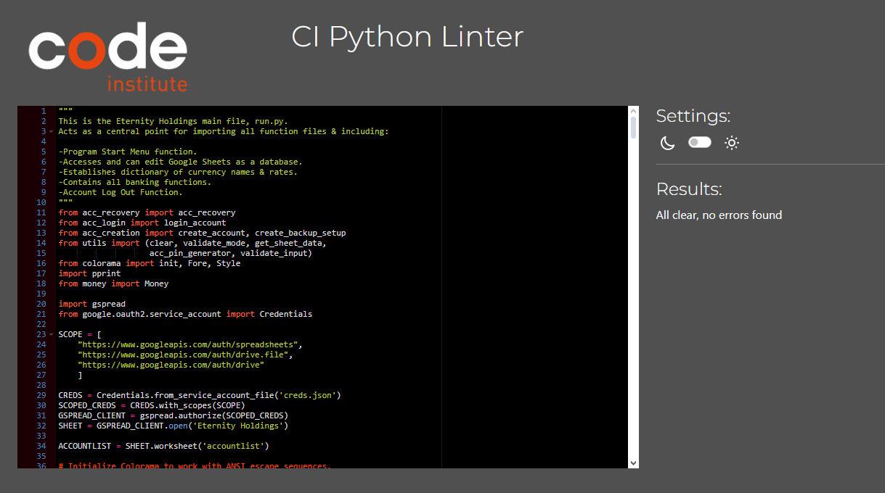
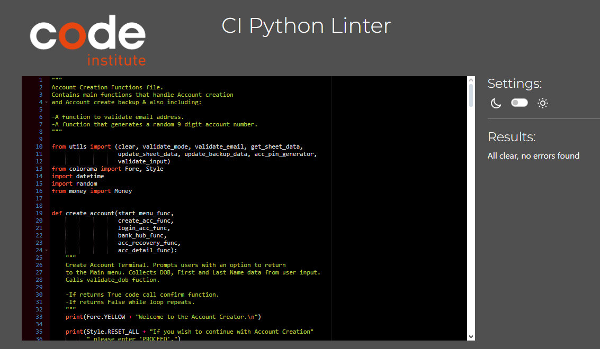
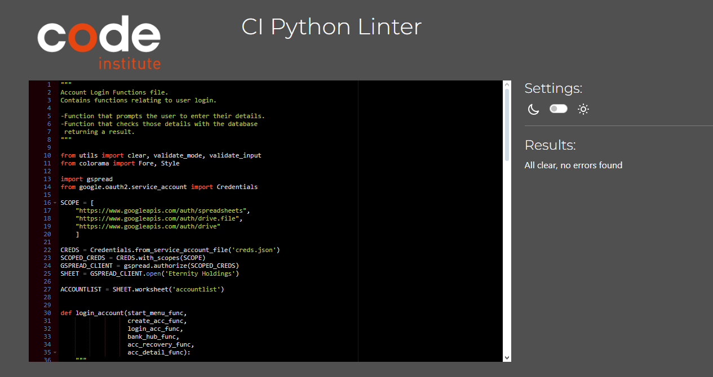
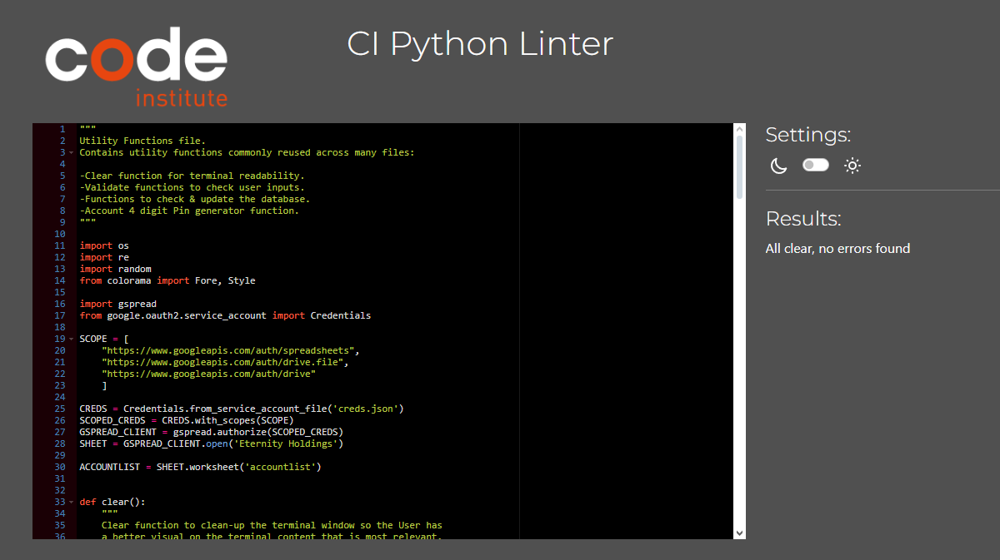
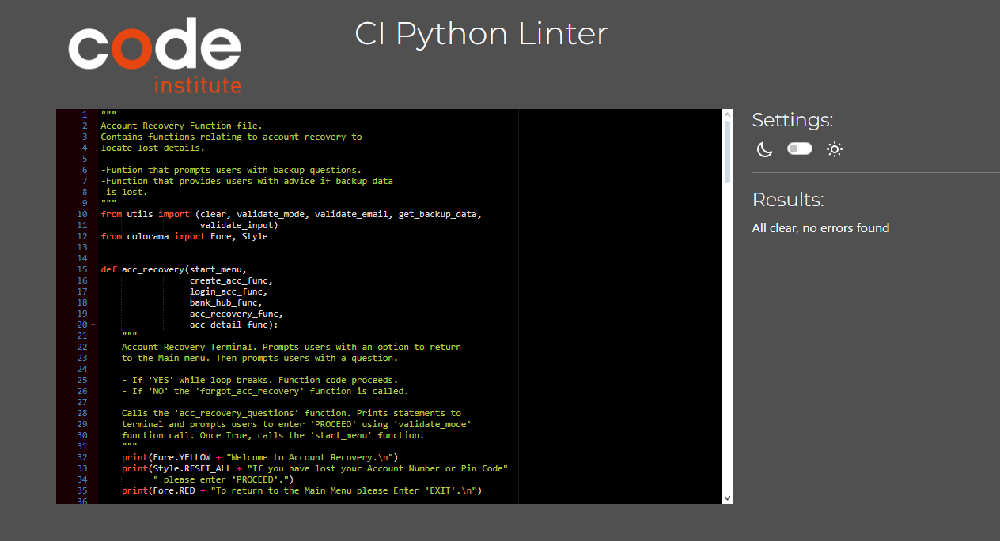

# Eternity Holdings

[Eternity Holdings](https://eternity-holdings-89f8c99223c1.herokuapp.com) has been designed as a mock prototype for a banking system. It's goal is to provide users with a virtual secure way to hold their money.

The Eternity Holdings prototype allows users to create an account & login to that account. The ability to check their Account balance, deposit funds up to 100,000 Euro into their account and also withdraw those funds as well. 
Users have control over what currency they wish to use which converts their account funds automatically. Users also are given a way to establish a Account recovery backup should they lose their account pin or number. Alongside the ability to change those details & Account pin as well should they wish to.

---

# Table of Contents

1. [UX](#ux)
   - [Goals](#goals)
     - [Visitor Goals](#visitor-goals)
     - [Business Goals](#business-goals)
     - [User Stories](#user-stories)
   - [Visual Design](#visual-design)
     - [Flowcharts](#flowcharts)

2. [Features](#features)

3. [Technology Used](#technology-used)
   - [Languages](#languages)
   - [Libraries](#libraries)
   - [Platforms](#platforms)
   - [Other Tools](#other-tools)

4. [Testing](#testing)
   - [Methods](#methods)
     - [Validation](#validation)
     - [General Testing](#general-testing)
   - [Bugs](#bugs)
     - [Known Bugs](#known-bugs)
     - [Fixed Bugs](#fixed-bugs)

5. [Deployment](#deployment)
    - [Github Deployment](#github-deployment)
        - [Github Preperation](#github-preparation)
        - [Github Instructions](#github-instructions)
        - [Google Sheets Instructions](#google-sheets-instructions)

6. [Credits and Contact](#credits-and-contact)
    - [Credits](#credits)
    - [Contact](#contact)

---

# UX

## Goals

### Visitor Goals

The target audience for Eternity Holdings are:

- Users that want a place to store their income.
- Users whom want to convert their funds easily.
- Users that don't want to be confused as to where and how to complete tasks.

The user goals are:

- To establish an Account with Eternity Holdings.
- To store funds in their Account.
- To withdraw those funds when needed.
- To use any currency they wish.
- To easily check account balance.
- To recover their account if they lost their pin or account numbers.

Eternity Holdings fills these goals by:

- Providing a clear & straight forward Account Creation & Login process. 
- Providing a deposit & withdrawal terminal once a user has logged in.
- Providing a Currency Converter system including a list of currently 11 supported currencies.
- Providing a quick & easy Account balance checker.
- Providing access to setup your Account recovery backup during Account Creation and later once logged in the ability to view, setup/change the Recovery Backup.
- Providing the ability to change the users Account Pin number.

### Business Goals

The Business Goals for Eternity Holdings are:

- Obtain more clients to build Bank balance.
- Be a respectable and trusted user bank.
- Be a good prototype showcase of a banking system.

### User Stories

1. As a User I want to be able to easily create and login to my account.
2. I'm someone who often misplaces and forgets numbers such as my Account Number and Pin. I want the ability to be able to get into my account if I lost them.
3. I want to be able to use different currencies, if it was one singular currency, it wouldn't be very flexible to use for me.
4. As a user I want to clearly read what i am looking at, too much white text on a screen can be very hard to read.

## Visual Design

### Flowcharts

Flowchart: A site called [Lucidchart](https://www.lucidchart.com) was used for the creation of the Project [Flowchart](https://lucid.app/lucidchart/2b48ac3d-3655-40a7-b44b-4afc8a233830/edit?viewport_loc=-1124%2C-212%2C9052%2C4612%2C0_0&invitationId=inv_d450b472-ad4d-46f3-9de1-6875b6845fb1).

---
# Features

---
# Technology Used

## Languages

- [Python](https://github.com/MarcusFDev/eternity-holdings-project3/blob/main/run.py)
    - Complete Project Functionality.

## Libraries

- [Colorama](https://pypi.org/project/colorama/)
    - For Terminal print to be colored for better project readability.
- [Money](https://pypi.org/project/money/)
    - For the user's Money to be formatted in a realistic way. 
- [GSpread](https://pypi.org/project/gspread/)
    - For Google Sheet functionality within the project to store all user Data.
- [PPrint](https://docs.python.org/3/library/pprint.html)
    - For dictionaries to be printed to the terminal in a better formatted way.
- [OS](https://docs.python.org/3/library/os.html)
    - For the use of a `clear()` function to maintain terminal readability.
- [Random](https://docs.python.org/3/library/random.html)
    - For generating random assortment of numbers used for Account Pin & Number.
- [Re](https://docs.python.org/3/library/re.html)
    - For excluding special characters in `validate_input` and matching email structure in `validate_email`.

## Platforms

- [Github](https://github.com/MarcusFDev/eternity-holdings-project3)
    - Storing code remotely.
- [Gitpod](https://www.gitpod.io)
    - IDE for project creation and development.
- [Heroku](https://eternity-holdings-89f8c99223c1.herokuapp.com)
    - Used for project deployment for a Python back-end project to be displayed on a front-end site.

## Other Tools

- [CI Python Linter](https://pep8ci.herokuapp.com)
    - Code Institute Python linter was used to validate every Python file.

# Testing

## Methods

### Validation

Each Eternity Holdings `.py` file was validated by the Code Institute Python Linter. Each file returning the same result.

- `run.py` file results:

- `acc_creation.py` file results:

- `acc_login.py` file results:

- `utils.py` file results:

- `acc_recovery.py` file results:

### General Testing

- After every alteration that was made to the code, everything was prompty tested to check for noticable changes.
- Entire program functionality for every feature together & individually was tested thoroughly in both the GitPod IDE terminal & Heroku deployment terminal.
- Every user input was tested for unintended functionality utilizing the following ways:
    - Standard single `a` and multiple `abc` latin alphabet letters.
    - Standard single `1` and multiple `123` numbers.
    - A empty `Enter` with no text content.
    - A `Enter` that contains only `Blank` spacing.
    - A user input containing `?@,/+!` special characters where not intended.
- Google Sheet database was observed each time a new data entry was sent to test the spreadsheet was correctly updating as intended.
- Program was tested by two other individuals.

## Bugs

### Known Bugs

No active known bugs have been detected in the program.

### Fixed Bugs

- Fixed a issue that caused a unintended error entering `.` in the `acc_deposit` & `acc_withdraw` user inputs.
- Fixed a user input issue that caused account recovery passwords to not be case sensitive.
- Fixed a input issue that allowed special characters, blank spaces & empty enters to be accepted when updating the database.
- Fixed multiple terminal errors relating to function paramaters after major code restructure.
- Fixed Docstrings to better explain functions & files respectively.
- Fixed a currency conversion issue that caused loss or multiply of currency upon conversion values being changed.

# Deployment

[Eternity Holdings](https://eternity-holdings-89f8c99223c1.herokuapp.com) is a entirely back-end Python project. It does not work as a front-end application on its own. 

To experience the project outside of a IDE terminal environment [Heroku](https://eternity-holdings-89f8c99223c1.herokuapp.com) was used to bring Eternity Holdings to a front-end experience via a website terminal. 

A Code Institute [template](https://github.com/Code-Institute-Org/p3-template) was used as a building crucial building block to bring Eternity Holdings to a front-end viewing state.

To view my Heroku deployment of Eternity Holdings please follow this [link]( https://eternity-holdings-89f8c99223c1.herokuapp.com).

## Github Deployment

### Github Preparation

Requirements:

- You need a GitHub account.
- You need a IDE such as [GitPod](https://gitpod.io).
- You need a Google account.

### Github Instructions

1. Log into your Github account and navigate to this link to the project repository: https://github.com/MarcusFDev/eternity-holdings-project3.
2. You can choose to create your own repository and copy or clone the project code. If making your own repository you must use the [template](https://github.com/Code-Institute-Org/p3-template) for the project to function as intended.
3. Upon creating a workspace in your IDE locate the `requirements.txt` file. If missing, create one with the exact name. In the terminal enter `pip3 freeze > requirements.txt` to activate all dependencies.
4. Please see and follow Google Sheets Instructions below and return to Step 5. 
5. Drag & Drop the Google Sheets `.json` file into your project and rename it to `creds.json`.

### Google Sheets Instructions

1. Login to Google Sheets and make a copy of this [spreadsheet](https://docs.google.com/spreadsheets/d/1ivq5-UThXv3ynS0U6XLn5EbKDd-Uz_1iM0zv7xx-28g/edit#gid=0). Remove 'Copy of' from the sheet title.
2. To connect the Google sheet to the IDE environment first go to the [Google Cloud](https://console.cloud.google.com/welcome?pli=1&project=lovesandwiches-419910) service. Click 'Select a project' then 'New Project'.
3. Name the project 'Eternity Holdings' and hit create. Make sure to navigate to your project dashboard.
4. Click APIs & Services then Library. Search for Google Drive API and enable it. This will take you to a page where you can click 'Create Credentials'. These steps must be followed correctly:

    1. Choose 'Google Drive API'.
    2. Select 'Application Data'.
    3. Select 'No, I'm not using them'.
    4. Click Next.
    5. Enter the Service Account name 'Eternity Holdings' and click Create.
    6. Choose 'Editor' then press Continue and then Done.
    7. Now, click on the service account that has been created, then Click 'Keys'.
    8. Click on 'Add Key' and select 'Create New Key'.
    9. Select JSON and then click Create. This will trigger a `json` file with your API credentials in it to download to your computer. 

5. Now search the API library for the Google Sheets API and select 'Enable'.

## Credits and Contact

### Credits

IDE Template:

- This Code Institute [template](https://github.com/Code-Institute-Org/p3-template) was used to set up the IDE environment for the Eternity Holdings project.

### Contact

Please feel free to reach out if you have any questions. Contact me via my email at marcusf.dev@gmail.com